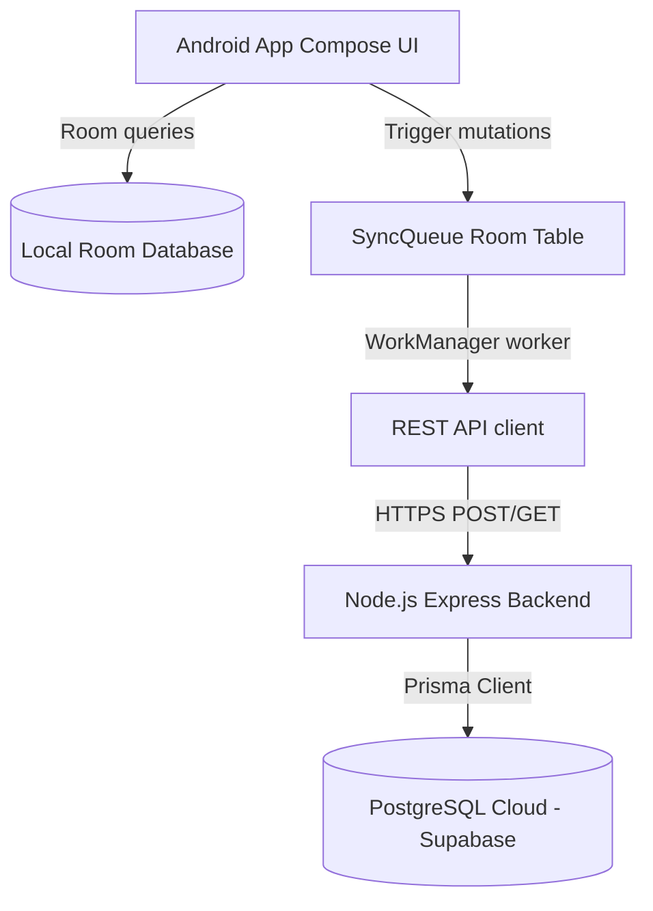

# System Architecture — Mediaxa Business Suite

This document defines the high-level architecture design and offline-first cloud synchronization patterns for the Mediaxa Business Suite.

---

## 1. Hybrid Offline-First Architecture

The application is structured as a dual-component platform:
1. **Client Terminal (Android)**: Native Kotlin application using Jetpack Compose, SQLite Room, and WorkManager. Operates fully offline.
2. **Sync Gateway (Backend)**: Express API built with Prisma ORM and PostgreSQL (Supabase/Neon). Handles conflict mapping, security, and storage.

---

## 2. Synchronization Flow (Sync Engine)

* **Push Mutations**: Terminal background tasks fetch pending client mutations from `SyncQueue` and POST them to `/api/v1/sync/push`.
* **Idempotency**: Pushed mutations contain a unique `clientMutationId` tracked on the backend in `processed_mutation_logs` to avoid duplicates.
* **Pull Queries**: Terminals issue GET requests to `/api/v1/sync/pull` using cursor pagination offsets to sync changes from other terminals.
* **Conflict Resolution**: Last-Write-Wins (LWW) resolution is applied using client timestamps (`updatedAt`). Conflicts are logged to `sync_conflicts` for auditing.

---

## 3. Security & Store Isolation
* **Store Boundaries**: Request bodies and parameters are validated against JWT tokens. A request trying to query a store other than the claim `storeUuid` will return a `403 Forbidden` response.
* **Device Registration**: Access tokens are coupled with registered device IDs. If a device connection is revoked, requests using its token are immediately denied.
