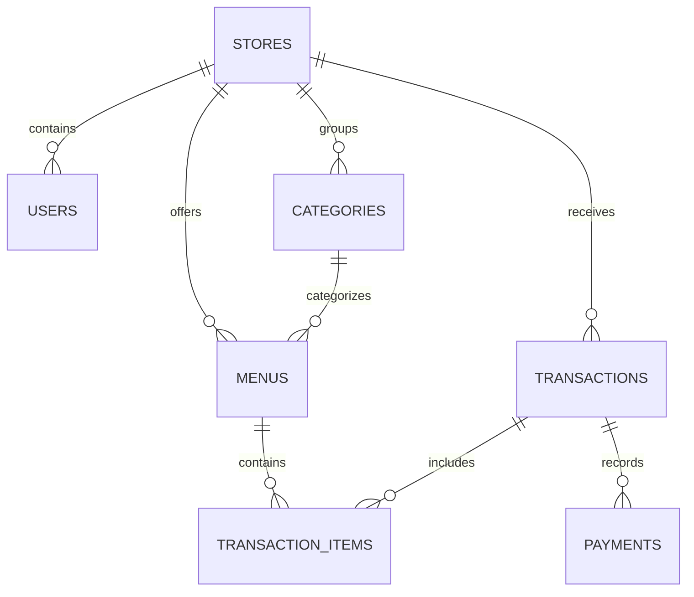

# Database Schema — Mediaxa Business Suite

This document defines the database tables, models, and relational configurations of the cloud sync gateway.

---

## 1. Relational Map

All tables are connected using **UUIDs** (`storeUuid`, `userUuid`, `menuUuid`, etc.) to align local SQLite Room structures with the cloud PostgreSQL schemas.

---

## 2. Table Specifications

### stores
* **uuid** (String, Unique Primary Key): Store identifier.
* **storeName** (String): Store title.
* **address** (String?): Store address.
* **phone** (String?): Contact phone number.

### users
* **uuid** (String, Unique PK)
* **storeUuid** (String, FK -> stores)
* **deviceId** (String)
* **username** (String, Unique)
* **passwordHash** (String): Hashed password.
* **pinHash** (String): Hashed cashier pin.
* **role** (Enum: ADMINISTRATOR, CASHIER, MANAGER)

### categories
* **uuid** (String, Unique PK)
* **storeUuid** (String, FK)
* **deviceId** (String)
* **name** (String)
* **isDeleted** (Boolean, Default: false)

### menus
* **uuid** (String, PK)
* **storeUuid** (String, FK)
* **deviceId** (String)
* **name** (String)
* **price** (Float)
* **categoryUuid** (String, FK -> categories)
* **isActive** (Boolean, Default: true)
* **isDeleted** (Boolean, Default: false)

### transactions (Immutable)
* **uuid** (String, PK)
* **storeUuid** (String, FK)
* **deviceId** (String)
* **cashierUserUuid** (String)
* **transactionDate** (DateTime)
* **subtotal** (Float)
* **transactionHpp** (Float): Cost of Goods Sold.
* **grossProfit** (Float): Gross profit margins.
* **marginPercent** (Float): Profit percentage.
* **total** (Float)
* **paymentMethod** (String)
* **status** (String)
